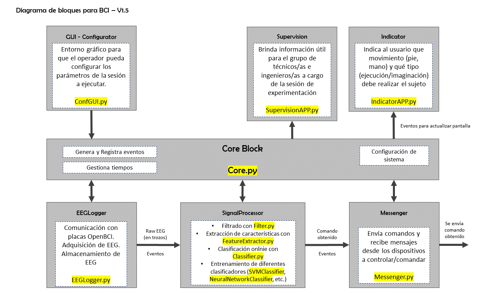
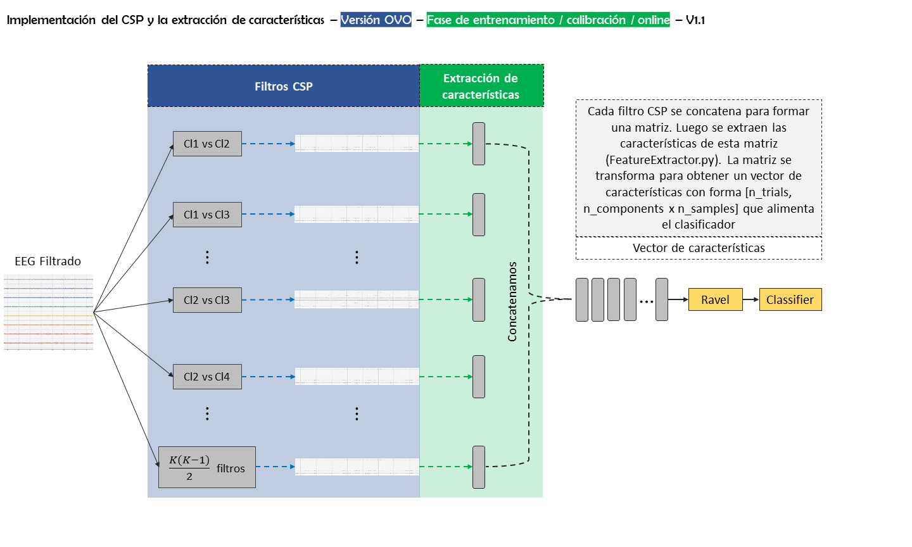

# Scripts Python - Revisión 8/3/2023

En esta sección se encuentra el código fuente de los diferentes scripts en python para implementar la ICC.

La siguiente imagen muestra el diagrama de bloques V1.4 de la BCI.

A continuación, se resume lo contenido dentro de cada directorio.

## Bloque principal - Core Block

Este módulo es el gestor y administrador de los principales procesos de la BCI, entre los que podemos destacar la escritura/lectura de datos -EEG, clasificadores-, gestión/escritura/lectura de eventos relevantes, procesamiento de EEG (online), gestión de las diferentes etapas de un trial.
Se comunica con todos los módulos.

Este módulo es el encargado de gestionar los siguientes procesos,

- Gestión de los trials. Temporización de cada etapa de un trial -tiempo para mostrar qué tarea debe ejecutar la persona, tiempo de estimulación, tiempo de descanso-.  

#### Responsable

- [x] Lucas Baldezzari

## Bloque de adquisición de señal - EEGLogger Block

Bloque para comunicación con placas OpenBCI a través de Brainflow. Este bloque permite la adquisición y registro de señales de EEG (rawEEG), información del acelerómetro, entre otros. Se comunica con el bloque de procesamiento de señal.

Esta gestión se hace con la clase *[EEGLogger.py](https://github.com/lucasbaldezzari/bcihack2/blob/main/Desarrollo/PythonScripts/scripts/EEGLogger/eegLogger.py)*.

#### Responsable

- [x] Lucas Baldezzari 

## Bloque de procesamiento de señal - Signal Processor Block

A continuación de mencionan las funcionalidades y clases del bloque,

### Primer filtrado de señal

Se aplican filtros pasabanda y notch a señal proveniente del bloque *EEGLogger* con la clase *[Filter.py](https://github.com/lucasbaldezzari/bcihack2/blob/main/Desarrollo/PythonScripts/scripts/SignalProcessor/Filter.py)*.

### Filtrado espacial - CSP

Filtrado con [CSP](https://github.com/lucasbaldezzari/bcihack2/blob/main/Desarrollo/PythonScripts/scripts/SignalProcessor/CSP.py). Esta clase aplica un filtrado espacial a través de [Common Spatial Pattern](https://en.wikipedia.org/wiki/Common_spatial_pattern#:~:text=Common%20spatial%20pattern%20(CSP)%20is,in%20variance%20between%20two%20windows). La misma hace uso de la clase [CSP](https://mne.tools/stable/generated/mne.decoding.CSP.html), pero se le agregan algunos métodos adicionales.

### Extracción de características

Extraer las características con el módulo *[FeatureExtractor.py](https://github.com/lucasbaldezzari/bcihack2/blob/main/Desarrollo/PythonScripts/scripts/SignalProcessor/FeatureExtractor.py)*. Luego de la etapa de filtrado se extrae la densidad espectral de potencia por método de [Welch](https://en.wikipedia.org/wiki/Welch%27s_method). Se filtra la información de las bandas *Mu* (8Hz a 13Hz) y *Beta* (13Hz a 30Hz).

Se plantean dos enfoques para la aplicación del CSP y la extracción de características. Una es la estrategia *OneVsOne* y la otra es *OneVsRest*.

La siguiente figura muestra un diagrama de aplicación de CSP y extracción de características para la fase de entrenamiento, la fase online es similar, sólo que los CSP no se entrenan, sino que se utilizan filtros previamente entrenados. Se utilizan las señales de EEG previamente filtradas (pasabanda y notch), trials y labels para obtener los filtros espaciales que proyectarán el EEG a un nuevo espacio. La cantidad de filtros espaciales a obtener está en función del número de clases. Si tenemos $K$, entonces tenemos $\fra{K(K-1)}{2}$ filtros espaciales.

A partir de las salidas de estos filtros se extraen sus características con *[FeatureExtractor.py](https://github.com/lucasbaldezzari/bcihack2/blob/main/Desarrollo/PythonScripts/scripts/SignalProcessor/FeatureExtractor.py)* y se concatenan cada una de estas para formar el **feature vector**.

### Clasificación
Clasificación con *Classifier.py* $^1$. 

Al momento se implementa una clase para intentar mejorar la extracción de características a través de Common Spatial Pattern. La clase es *[CommonSpatialPatter](https://github.com/lucasbaldezzari/bcihack2/blob/main/Desarrollo/PythonScripts/scripts/SignalProcessor/CSP.py)*. 

**NOTA:** Las clases dentro del bloque de _SignalProcessor_ se implementan como si fueran _[Transformers](https://scikit-learn.org/stable/data_transforms.html)_ de ScikitLearn (heredan de BaseEstimator, TransformerMixin). La idea es poder utilizar estos objetos en un _[Pipeline](https://scikit-learn.org/stable/modules/generated/sklearn.pipeline.Pipeline.html)_, lo que nos da la ventaja de probar diferentes estrategias de manera rápida y sencilla.

$^1$_Importante:_ Queda pendiente definir si se usará esta clase o directamente un clasificador de sklearn.

#### Responsable

- [x] Lucas Baldezzari 

## Bloque para transmitir/recibir mensajes- Messenger Block

Bloque para comunicación entre PC y el ejecutor (que será un brazo robótico y una silla de ruedas). Los comandos obtenidos por el bloque de clasificación son enviados al dispositivo a controlar. El bloque de mensajería tambien puede recibir mensajes desde el dispositivo controlado.

#### Responsable

- [x] Lucas Baldezzari 

## GUI Block

Bloques de interfaces visuales.
**TODO**

### Responsables

- [x] Emiliano Álvarez
- [x] Lucas Baldezzari

### Dependencias

La versión de python a utilizar será *>= 3.10.1*

- Dependencias necesarias para ejecutar, probar y ejecutar estos scripts (Completar por *Lucas*).